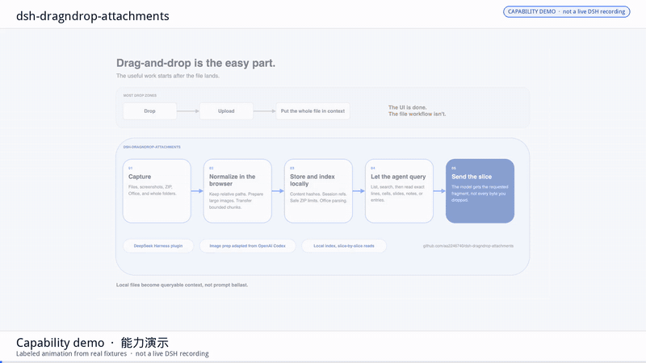

# DSH DragNDrop Attachments

A DeepSeek Harness RC8 plugin for dragging files, Finder folders, Office documents, and ZIP archives into a session. It indexes them locally, then gives the model tools to retrieve the requested lines, ranges, slides, notes, or archive entries.


[Editable draw.io source](docs/assets/dsh-dragndrop-architecture.drawio)

## 演示视频 / Demo video



This is a **labeled capability demo** built from the real `tests/fixtures` files and the architecture art above. It is not a live DeepSeek Harness screen recording — that UI needs macOS Apple Silicon and a running Host.

It shows page-wide drop (image, Finder folder, DOCX / XLSX / PPTX, ZIP), paste, and on-demand tools (`search_attachment`, `read_spreadsheet_range`, `read_slide`) so the model receives a slice instead of the whole file.

- Shot list and fixture map: [docs/demo/SHOTLIST.md](docs/demo/SHOTLIST.md)
- X-ready H.264: [docs/demo/out/plugin-demo.mp4](docs/demo/out/plugin-demo.mp4)
- Assemble (from this repo):

```sh
cd docs/demo
./assemble.sh              # capability MP4 + GIF
./assemble.sh --from-raw   # stitch raw/*.mov|mp4; missing clips dry-run and exit 0
```

## What came from Codex

The image-preparation path adapts [OpenAI Codex's open-source prompt-image logic](https://github.com/openai/codex/tree/main/codex-rs/utils/image): side and patch budgets, proportional resizing, source-byte passthrough, GIF normalization, and process caching. We translated it from Rust to TypeScript and integrated it with DSH's native image attachment path.

The rest of the pipeline was built for DSH: page-wide drop and paste capture, folder snapshots, loopback chunk transfer, session storage, ZIP and Office indexing, and tools that retrieve only the requested parts.

这是社区项目，与 DeepSeek、OpenAI 或 Anthropic 没有隶属或官方合作关系。

## 用户能直接做什么

- 把图片、Markdown、文本、代码、CSV、DOCX、XLSX、PPTX、ZIP 或 Finder 文件夹拖到 DSH 页面任意位置；混合拖放也保持每个文件夹的根和相对路径。
- 从剪贴板粘贴文件或图片，或点击 DSH 原生 `+`，在同一菜单中选择“文件和文件夹”，再选择“选择文件”或“选择文件夹”；原有命令全部保留。
- 预览、移除尚未提交的附件，并查看上传/解析进度和明确错误。
- 直接发送超大像素图片。插件会按 DSH RC8 的原生边界无感等比缩放，再进入 DSH 原生图片管线。
- 让模型按需搜索文档、读取 Word 语义路径、Excel/CSV 精确区间、PPT 页面与演讲者备注，而不是把整个文件粗暴塞进 prompt。
- 让模型先看 ZIP 目录，再搜索其中的文本/代码并按准确路径和行范围读取；二进制条目只列目录，不盲目解压进 prompt。
- 刷新页面或重新打开会话后继续查询已提交附件。

## 支持格式

| 类别 | 格式 | 处理方式 |
| --- | --- | --- |
| 图片 | PNG、JPEG/JPG、WebP、GIF | 浏览器端探测；必要时缩到最长边不超过 2000 px 且不超过 2500 个 32 px patch，再交给 DSH 原生图片附件 |
| 文档 | DOCX | 段落、标题、表格、页眉页脚、脚注/尾注、批注与稳定语义定位符 |
| 表格 | XLSX | 工作表、隐藏表、单元格、合并单元格、公式、已保存值与精确范围 |
| 演示 | PPTX | 幻灯片正文、形状文本、图片位置、演讲者备注与页码定位符 |
| 数据 | CSV | UTF-8、GB18030、引号字段、字段内换行/逗号；按表格区间读取 |
| 文本 | TXT、Markdown、JSON/JSONL、YAML、TOML、XML、TSV、日志及常见代码文件 | UTF-8 本地索引、标题/行块、搜索与分段读取 |
| 压缩包 | ZIP | 安全目录索引；文本/代码跨文件搜索及按路径、行范围读取；二进制条目只列清单 |
| 文件夹 | Finder 文件夹 | 目录、空目录（浏览器支持时）、相对路径和内容被保存为确定性本地快照；卡片和模型工具始终显示为文件夹，不显示伪造 ZIP 文件名 |

旧版二进制 Office 文件 `.doc/.xls/.ppt` 不接受；请先另存为 `.docx/.xlsx/.pptx`。加密 Office 文件需先移除密码。PDF 尚未纳入 1.2.0。当前压缩包格式是 ZIP；RAR、7z、tar/tgz 和嵌套压缩包自动展开不在本版能力内。

默认边界：单文件 50 MiB、每会话 20 个附件、每会话总计 100 MiB。一个文件夹最多 10000 个条目、100 MiB 源文件和 128 MiB 确定性快照。Office 解析另有节点量、输出量和 30 秒超时边界。ZIP 在落盘前检查路径穿越、重复路径、压缩算法、最多 10000 个条目、解压后 256 MiB、单条目压缩比 100；单个可读文本条目上限 8 MiB，一次搜索最多解压 32 MiB 文本。

## 一键安装

要求：macOS Apple Silicon、DeepSeek Harness `0.1.0-rc.8`、已配置 `dshx`、Node.js 22.19+、pnpm，以及正在运行的 Web Host（默认端口 `43127`）。

从 [Releases](https://github.com/aa2246740/dsh-dragndrop-attachments/releases) 下载 `dsh-dragndrop-attachments-1.2.0.tgz`，核对 Release 页面给出的 SHA-256，然后执行：

```sh
tar -xzf dsh-dragndrop-attachments-1.2.0.tgz
cd package
./install.sh
```

安装器只会：

1. 在 `my-plugins/dsh-dragndrop-attachments` 建立指向外部插件目录的符号链接；
2. 安装插件自己的依赖并重建插件产物；
3. 运行 `dshx check`；
4. 用 `activate-new-client` 把插件挂入当前 Host。

它不会修改 Harness 的 tracked source。首次安装通过外部插件配置热挂载，Host 不重启，刷新一次页面即可载入新的客户端入口；以后只改客户端时由 HMR 接管。升级到包含新 Host 逻辑的版本时，需要集中重启一次 DSH Host 以换入新的插件模块，这不等于修改 Harness 源码。

若 Web 端口不是 43127：

```sh
DSH_WEB_PORT=你的端口 ./install.sh
```

若 `dshx` 尚未记录 Harness 路径：

```sh
DSHX_HARNESS=/绝对路径/deepseek-harness-rc8 ./install.sh
```

详细使用和排障见 [USER_GUIDE.zh-CN.md](USER_GUIDE.zh-CN.md)。

## 本地数据与隐私

非图片附件保存在 `~/.dsh/dragndrop-attachments/v1`：内容寻址对象、结构化索引和按会话哈希命名的引用表彼此分离。模型只通过 10 个有界工具渐进读取当前会话附件。附件正文被明确标记为不可信用户数据，不会被当作系统指令。若本机存在早期私有预览版的 `~/.dsh/codex-attachments/v1`，插件会继续使用它，避免丢失原有会话附件。

图片沿用 DSH 原生草稿附件和模型输入路径。插件不建立额外上传服务、不启用 OfficeCLI 自动更新，也不自动安装 OfficeCLI 依赖；当模型实际调用附件工具时，工具返回的相关片段仍会按 DSH 当前模型配置发送给该模型提供方。

## 开发与验收

```sh
pnpm install --ignore-workspace --frozen-lockfile
pnpm check
/path/to/deepseek-harness-rc8/tools/dshx/skill/dshx/scripts/dshx.sh check dsh-dragndrop-attachments --harness /path/to/deepseek-harness-rc8
pnpm release -- /path/to/output-directory
pnpm verify:package -- /path/to/dsh-dragndrop-attachments-1.2.0.tgz
```

`verify:package` 会从最终压缩包重新解压，在当前 pnpm 缓存下离线安装依赖，然后重新运行测试、构建、文件清单、OfficeCLI 版本与 SHA-256 校验。构建还会拒绝浏览器包中任何意外泄漏的 Node 内置模块，避免出现“本地构建成功、DSH 浏览器加载失败”的假绿灯。

## 架构边界

- UI：外部 client 插件通过公开 `commandUi.register` 把附件入口并入官方 `+` 菜单；`conversation.input.dock` 只在上传、报错或已有附件时显示卡片；capture phase 接管页面拖放/粘贴。
- 传输：loopback RPC，768 KiB 顺序 Base64 分块，临时文件提交后清理。
- 存储：插件自己的本地 CAS/结构索引与原子会话引用，不改 RC8 只支持图片的原生附件协议。
- 模型：`list_attachments`、outline、search、blocks、archive entry、folder entry、folder Office query、spreadsheet range、slide、document path 等有界工具；文件夹内 Office 仍按相对路径和父附件 ID 授权。
- Office：随包固定 OfficeCLI 1.0.144（macOS arm64），校验信息见 `vendor/officecli/manifest.json`。

第三方许可见 [THIRD_PARTY_NOTICES.md](THIRD_PARTY_NOTICES.md)。
